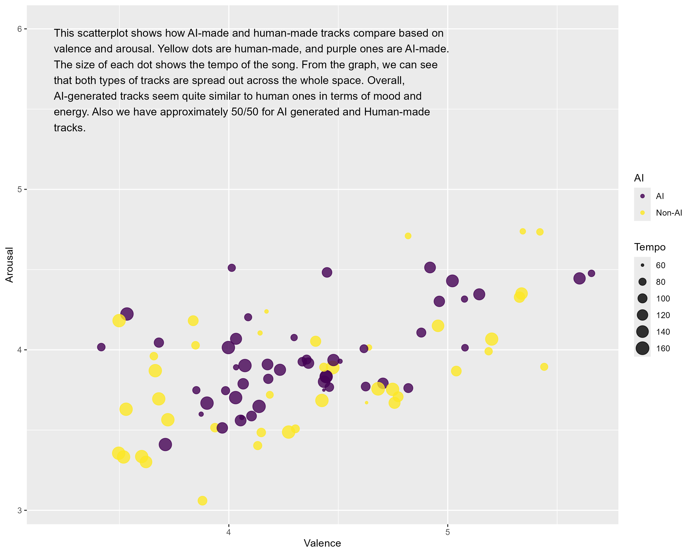

```{r setup, include=FALSE}
library(ggplot2)
library(plotly)
library(tidyverse)
library(flexdashboard)
library(readr)
library(signal)
library(tidymodels)
library(ggdendro)
library(heatmaply)
library(dplyr)
library(kknn)
library(patchwork)
library(magrittr)
library(ranger)
library(forcats)
library(dendextend)
library(tidyr)
library(recipes)
source("compmus.R")

major_chord <-
  c(   1,    0,    0,    0,    1,    0,    0,    1,    0,    0,    0,    0)
minor_chord <-
  c(   1,    0,    0,    1,    0,    0,    0,    1,    0,    0,    0,    0)
seventh_chord <-
  c(   1,    0,    0,    0,    1,    0,    0,    1,    0,    0,    1,    0)

major_key <-
  c(5.0, 2.0, 3.5, 2.0, 4.5, 4.0, 2.0, 4.5, 2.0, 3.5, 1.5, 4.0)
minor_key <-
  c(5.0, 2.0, 3.5, 4.5, 2.0, 4.0, 2.0, 4.5, 3.5, 2.0, 1.5, 4.0)

chord_templates <-
  tribble(
    ~name, ~template,
    "Gb:7", circshift(seventh_chord, 6),
    "Gb:maj", circshift(major_chord, 6),
    "Bb:min", circshift(minor_chord, 10),
    "Db:maj", circshift(major_chord, 1),
    "F:min", circshift(minor_chord, 5),
    "Ab:7", circshift(seventh_chord, 8),
    "Ab:maj", circshift(major_chord, 8),
    "C:min", circshift(minor_chord, 0),
    "Eb:7", circshift(seventh_chord, 3),
    "Eb:maj", circshift(major_chord, 3),
    "G:min", circshift(minor_chord, 7),
    "Bb:7", circshift(seventh_chord, 10),
    "Bb:maj", circshift(major_chord, 10),
    "D:min", circshift(minor_chord, 2),
    "F:7", circshift(seventh_chord, 5),
    "F:maj", circshift(major_chord, 5),
    "A:min", circshift(minor_chord, 9),
    "C:7", circshift(seventh_chord, 0),
    "C:maj", circshift(major_chord, 0),
    "E:min", circshift(minor_chord, 4),
    "G:7", circshift(seventh_chord, 7),
    "G:maj", circshift(major_chord, 7),
    "B:min", circshift(minor_chord, 11),
    "D:7", circshift(seventh_chord, 2),
    "D:maj", circshift(major_chord, 2),
    "F#:min", circshift(minor_chord, 6),
    "A:7", circshift(seventh_chord, 9),
    "A:maj", circshift(major_chord, 9),
    "C#:min", circshift(minor_chord, 1),
    "E:7", circshift(seventh_chord, 4),
    "E:maj", circshift(major_chord, 4),
    "G#:min", circshift(minor_chord, 8),
    "B:7", circshift(seventh_chord, 11),
    "B:maj", circshift(major_chord, 11),
    "D#:min", circshift(minor_chord, 3)
  )

key_templates <-
  tribble(
    ~name, ~template,
    "Gb:maj", circshift(major_key, 6),
    "Bb:min", circshift(minor_key, 10),
    "Db:maj", circshift(major_key, 1),
    "F:min", circshift(minor_key, 5),
    "Ab:maj", circshift(major_key, 8),
    "C:min", circshift(minor_key, 0),
    "Eb:maj", circshift(major_key, 3),
    "G:min", circshift(minor_key, 7),
    "Bb:maj", circshift(major_key, 10),
    "D:min", circshift(minor_key, 2),
    "F:maj", circshift(major_key, 5),
    "A:min", circshift(minor_key, 9),
    "C:maj", circshift(major_key, 0),
    "E:min", circshift(minor_key, 4),
    "G:maj", circshift(major_key, 7),
    "B:min", circshift(minor_key, 11),
    "D:maj", circshift(major_key, 2),
    "F#:min", circshift(minor_key, 6),
    "A:maj", circshift(major_key, 9),
    "C#:min", circshift(minor_key, 1),
    "E:maj", circshift(major_key, 4),
    "G#:min", circshift(minor_key, 8),
    "B:maj", circshift(major_key, 11),
    "D#:min", circshift(minor_key, 3)
  )

source("compmus.R")

get_conf_mat <- function(fit) {
  outcome <- .get_tune_outcome_names(fit)
  fit |> 
    collect_predictions() |> 
    conf_mat(truth = outcome, estimate = .pred_class)
}  

get_pr <- function(fit) {
  fit |> 
    conf_mat_resampled() |> 
    group_by(Prediction) |> mutate(precision = Freq / sum(Freq)) |> 
    group_by(Truth) |> mutate(recall = Freq / sum(Freq)) |> 
    ungroup() |> filter(Prediction == Truth) |> 
    select(class = Prediction, precision, recall)
}  
```


Introduction {.storyboard}
=========================================
### My tracks

Welcome to my musicology GitHub page! In the next tab, you'll find visualizations of the class corpus, along with detailed analyses of two tracks - one of which was created using AI.

I didn’t just use AI for music generation - I also used it to help clean up and improve the graphs. Although the original code was provided during class, I customized and styled some of the plots with the help of ChatGPT to make them a bit prettier and more readable.

While building this portfolio, I ran into a knitting issue that completely broke the tab layout. To fix it, I had to use HTML to properly align the content and keep the structure clean. That was definitely a challenge, but also a good learning moment. However, I acknowledge that some parts of the code might look a bit messy, since generative AI tends to do that sometimes.

Back to the project!  I created one track using generative AI. Can you guess which one it is?

The second track was taken from SoundCloud’s open library. I assume it was human-made, but I can’t say for certain—it might have been AI-generated too. Hopefully, the analysis that follows will help uncover whether it was crafted by a human, or maybe even through a human-AI collaboration!

As for my AI-generated track, here’s the prompt I used (I think it turned out pretty creatively!):


*Create a 2-minute 30-second high-energy music track inspired by anime battle scenes. Blend intense orchestral elements with modern electronic sounds, including powerful synths, bass drops, and driving percussion. Take inspiration from epic anime moments and Tchaikovsky’s dynamic compositions, ensuring fluid transitions between suspenseful buildups and explosive, adrenaline-filled peaks. Deliver a dramatic, fast-paced sound with depth, combining classical grandeur with contemporary electronic intensity.*


My tracks (it might be written that you do not have access to it since it is google drive, but choose open the document - the access is given. Inserting audio here did not work for me, so I came up with this method instead)

```{=html}

<iframe style="border-radius:12px" src="https://drive.google.com/file/d/1Wf9LaqRy12SFJ66BRiyCZD91vr23GfYu/view?usp=drive_link" width="100%" height="160" frameborder="0" allowfullscreen="" allow="autoplay; clipboard-write; encrypted-media; fullscreen; picture-in-picture" data-external="1"></iframe>

<iframe style="border-radius:12px" src="https://drive.google.com/file/d/1JTKeVuyFC3kppAtkzoHiGC10VklFCU7J/view?usp=drive_link" width="100%" height="160" frameborder="0" allowfullscreen="" allow="autoplay; clipboard-write; encrypted-media; fullscreen; picture-in-picture" data-external="1"></iframe>
```

The Corpus {.storyboard}
=====================

### Class Corpus Visualization
```{r class corpus, echo=FALSE}
library(readr)
library(ggplot2)
library(viridis)

compmus2025 <- read_csv("C:\\Users\\aneru\\musika2\\compmus2025.csv")

# Build the ggplot object
p <- compmus2025 |>
  ggplot(
    aes(
      x = valence,
      y = arousal,
      colour = danceability
    )
  ) +
  geom_point(size = 2.5, alpha = 0.8) +
  geom_smooth(method = "loess", se = FALSE, linewidth = 1, colour = "gray30") +
  geom_rug(linewidth = 0.2, alpha = 0.5) +
  scale_x_continuous(
    limits = c(3, 5),
    breaks = c(3, 4, 5, 6, 7),
    minor_breaks = NULL
  ) +
  scale_y_continuous(
    limits = c(3, 6),
    breaks = c(3, 4, 5, 6, 7, 8),
    minor_breaks = NULL
  ) +
  scale_colour_viridis_c(option = "turbo") +
  theme_light(base_size = 14) +
  labs(
    title = "Valence vs. Arousal",
    subtitle = "Colored by Danceability",
    x = "Valence",
    y = "Arousal",
    colour = "Danceability"
  ) +
  theme(
    plot.title = element_text(face = "bold", hjust = 0.5),
    plot.subtitle = element_text(hjust = 0.5)
  )

# Show plot
p
```
***
This graph shows the relationship between **Valence** (how happy or positive a song sounds) and **Arousal** (how energetic a song is). The x-axis represents Valence, and the y-axis represents Arousal.

Each dot on the graph represents a song. The color of the dots shows **Danceability**, with purple meaning less danceable and yellow meaning more danceable.There is also a grey trend line in the graph, showing that as Valence increases, Arousal also tends to increase. So in other words, when song sounds happier, it also has more energy. However, the gray area around the line shows some uncertainty, meaning not every song follows this trend exactly.

On the sides of the graph, there are small tick marks (rug plots) that show how many songs fall into different Valence and Arousal levels. 

Overall, the graph suggests that happier songs tend to be more energetic, and danceability varies, with some of the most danceable songs appearing in the high-energy, happy range.

### Clustering
```{r dendrogram, echo=FALSE, results='asis'}
cluster_juice <-
  recipe(
    filename ~
      arousal +
      danceability +
      instrumentalness +
      tempo +
      valence,
    data = compmus2025
  ) |>
  step_center(all_predictors()) |>
  step_scale(all_predictors()) |>
  prep(compmus2025) |>
  juice() |>
  column_to_rownames("filename")

compmus_dist <- dist(cluster_juice, method = "euclidean")

dendro_plot <- compmus_dist |>
  hclust(method = "complete") |>
  dendro_data() |>
  ggdendrogram()

ggsave("dendrogram.png", dendro_plot, width = 12, height = 10)

text_dendrogram <- "
This plot shows how the songs are grouped based on how similar they are. Songs that are more alike are joined together lower in the tree. Songs that are more different connect higher up. 

Even though the names at the bottom are hard to read, we can still see that some songs form small, tight groups, while others belong to larger clusters. This suggests that certain tracks in the dataset are very similar to each other, while some stand out as more unique. I think this could be related to the use of AI. Since most of us aren’t professional AI music creators, the results we produce might end up sounding quite similar. This dendrogram especially highlights how some of these AI-generated tracks tend to cluster together.
"

cat("<div style='display: flex; flex-direction: row;'>")
cat("<div style='display: flex; flex-direction: row;'>")
cat("")
cat("</div>")
cat(paste0("<div style='flex: 1; padding-left: 40px;'>", text_dendrogram, "</div>"))
cat("</div>")
```

### Full Class Corpus Heatmap
```{r}
# Show every 8th row name only
row_labels <- rownames(cluster_juice)
custom_row_labels <- ifelse(seq_along(row_labels) %% 8 == 1, row_labels, "")

# Clean and readable heatmap
heatmaply(
  cluster_juice,
  dist_method = "euclidean",
  hclust_method = "average",
  k_col = 4,
  k_row = 4,
  plot_method = "plotly"
)
```
***
The dendrogram heatmap shows the result of clustering class corpus tracks based on their musical features: **valence**, **arousal**, **danceability**, **instrumentalness**, and **tempo**. Since each student uploaded two tracks, the dataset is quite large, and as a result, the track names often overlap on the graph, making them hard to read. In this section, I’ll focus on some general observations from the “big picture”, while in another tab you can see my specific tracks and where they are shown in the context of 10 randomly selected tracks.

In this heatmap, we can see that tracks with similar musical characteristics are grouped close to each other. For example, tracks with high arousal and valence (highlighted in yellow) are clustered in one area of the dendrogram, while tracks with high instrumentalness and low danceability (shown in darker shades) form different clusters. It's interesting that the two tracks submitted by the same person are often located next to each other. I think this might be because many of us used generative AI to create our tracks, and the AI tends to follow similar patterns, which makes the songs sound alike—even with different inputs.

### My Tracks In Class Corpus Heatmap
```{r}
# Ensure reproducibility
set.seed(123)

# Define rows to include
highlight_names <- c("aleksandra-b-1", "aleksandra-b-2")
all_rows <- rownames(cluster_juice)

# Filter to keep those two
mandatory_rows <- all_rows[tolower(all_rows) %in% tolower(highlight_names)]

# Sample 8 more rows randomly (excluding the highlighted ones)
remaining_rows <- setdiff(all_rows, mandatory_rows)
random_rows <- sample(remaining_rows, size = 8)

# Combine into final subset
selected_rows <- c(mandatory_rows, random_rows)
subset_data <- cluster_juice[selected_rows, ]

# Plot the heatmap
heatmaply(
  subset_data,
  dist_method = "euclidean",
  hclust_method = "average",
  k_col = 2,  # fewer clusters since we have fewer rows
  k_row = 2,
  plot_method = "plotly",
  row_text_angle = 0,
  column_text_angle = 45,
  fontsize_row = 12,
  fontsize_col = 12,
  margins = c(80, 150)
)

```
***
Here is the smaller heatmap, where I included my two tracks (**aleksandra-b-1** and **aleksandra-b-2**) along with 10 random others. My tracks are placed close together, which makes sense since they’re both electronic. The first one was taken from SoundCloud, and the second was created with generative AI. Even though the first track is human-made, it still shows some typical AI-like qualities, which is noticeable in the heatmap. Both tracks have **low instrumentalness** and **high arousal/valence**, which likely explains why they ended up in the same cluster.

### Class Corpus: Is It  AI-made Or Not? 
```{r, echo=FALSE, results='asis'}
library(readr)
library(dplyr)
library(ggplot2)
library(viridis)

compmus2025_filtered <- compmus2025 %>%
  dplyr::filter(!is.na(ai)) %>%
  dplyr::mutate(ai = factor(dplyr::if_else(ai, "AI", "Non-AI")))

# Create the explanation text
explanation_text <- "This scatterplot shows how AI-made and human-made tracks compare based on valence and arousal. Yellow dots are human-made, and purple ones are AI-made. The size of each dot shows the tempo of the song. From the graph, we can see that both types of tracks are spread out across the whole space. Overall, AI-generated tracks seem quite similar to human ones in terms of mood and energy. Also we have approximately 50/50 for AI generated and Human-made tracks."

# Create the plot
p <- compmus2025_filtered |>
  ggplot(aes(
    x = arousal,
    y = valence,
    colour = ai,
    size = tempo
  )) +
  geom_point(alpha = 0.8) +
  scale_color_viridis_d() +
  labs(
    x = "Valence",
    y = "Arousal",
    size = "Tempo",
    colour = "AI"
  ) +
  annotate(
    "text", x = 3.2, y = 6.0, hjust = 0, vjust = 1, size = 4,
    label = strwrap(explanation_text, width = 80) |> paste(collapse = "\n")
  )

# Save and include the image
ggsave("ai_vs_human.png", p, width = 10, height = 8)

```

### AI tracking prediction
```{r ai_prediction_plots, echo=FALSE, results='asis'}
classification_recipe <-
  recipe(
    ai ~ arousal + danceability + instrumentalness + tempo + valence,
    data = compmus2025_filtered
  ) |>
  step_center(all_predictors()) |>
  step_scale(all_predictors())

# Cross-validation folds
compmus_cv <- compmus2025_filtered |> vfold_cv(5)

# KNN model
knn_model <-
  nearest_neighbor(neighbors = 1) |>
  set_mode("classification") |>
  set_engine("kknn")

classification_knn <-
  workflow() |>
  add_recipe(classification_recipe) |>
  add_model(knn_model) |>
  fit_resamples(compmus_cv, control = control_resamples(save_pred = TRUE))

# Enhanced Confusion Matrix Plot
conf_plot <- classification_knn |>
  get_conf_mat() |>
  autoplot(type = "heatmap") +
  scale_fill_gradient2(
    low = "#F94144", mid = "#F9C74F", high = "#43AA8B", midpoint = 15
  ) +
  theme_minimal(base_size = 14) +
  labs(title = "KNN Confusion Matrix")

ggsave("knn_confusion_matrix.png", conf_plot, width = 10, height = 8)

text_output_knn <- "
This confusion matrix visualizes how well the k-nearest neighbors model distinguishes between AI-generated and human-made tracks. The majority of AI tracks were predicted correctly, as shown in the top-left cell, while the model also correctly identified a portion of Non-AI tracks. However, there is a noticeable number of errors: some AI tracks were misclassified as human-made and vice versa. In overall, the results show that the model can tell the difference between AI and Non-AI tracks to some extent, but it still makes mistakes. It does a better job predicting AI tracks, but has more trouble correctly identifying the Non-AI ones.
"

# Random Forest model
forest_model <-
  rand_forest() |>
  set_mode("classification") |>
  set_engine("ranger", importance = "impurity")

# Fit for feature importance
variable_importance_plot <- workflow() |>
  add_recipe(classification_recipe) |>
  add_model(forest_model) |>
  fit(compmus2025_filtered) |>
  pluck("fit", "fit", "fit") |>
  ranger::importance() |>
  enframe() |>
  mutate(name = fct_reorder(name, value)) |>
  ggplot(aes(name, value, fill = value)) +
  geom_col(show.legend = FALSE) +
  geom_text(aes(label = round(value, 2)), hjust = -0.1, size = 4) +
  scale_fill_viridis_c(option = "inferno") +
  coord_flip() +
  theme_minimal(base_size = 14) +
  labs(x = NULL, y = "Importance", title = "Random Forest: Feature Importance") +
  theme(plot.margin = margin(10, 20, 10, 10))

ggsave("variable_importance.png", variable_importance_plot, width = 10, height = 8)

text_output_forest <- "
The second plot shows which features were most useful for the model when deciding if a track was made by AI or not. **Instrumentalness** was the most important — AI tracks were often more or less instrumental than human-made ones. **Arousal** and **danceability** also helped a bit, while **tempo** and **valence** didn’t matter as much.
"

# Layout output
cat("<div style='display: flex; flex-direction: row; margin-bottom: 30px;'>")
cat("<div style='display: flex; flex-direction: row;'>")
cat("")
cat("</div>")
cat(paste0("<div style='flex: 1; padding-left: 40px;'>", text_output_knn, "</div>"))
cat("</div>")

cat("<div style='display: flex; flex-direction: row;'>")
cat("<div style='display: flex; flex-direction: row;'>")
cat("")
cat("</div>")
cat(paste0("<div style='flex: 1; padding-left: 40px;'>", text_output_forest, "</div>"))
cat("</div>")
```
### Summary
This section looked at all the songs in the class dataset. The scatterplot shows that happier songs usually have more energy, and more danceable tracks often fall into that category too. For our class, the overall mood seems chill or balanced, since most of the songs fall between valence 3.5 and 4.5.

The dendrogram and heatmaps also show that some songs are very similar, especially the AI-generated ones. This might be because many of us used similar tools or prompts when creating music with AI.

Finally, we tested models to see if they could guess whether a track was made by AI or a human. The KNN model performed fairly well, especially at identifying AI tracks. The most important feature for the model was instrumentalness, which helped it tell the difference between AI and human-made songs.

Visualisations {.storyboard}
=========================================
### Chromagrams
```{r, echo=FALSE, results='asis'}
plot_first_chroma <- "features/aleksandra-b-1.json" |>
  compmus_chroma(norm = "manhattan") |>
  ggplot(aes(x = time, y = pc, fill = value)) +
  geom_raster() +
  scale_y_continuous(
    breaks = 0:11,
    minor_breaks = NULL,
    labels = c(
                "C", "C#|Db", "D", "D#|Eb",
                "E", "F", "F#|Gb", "G",
                "G#|Ab", "A", "A#|Bb", "B"
              )
  ) +
   scale_x_continuous(
    breaks = seq(0, 200, 50),  # More structured x-axis ticks
    minor_breaks = NULL
  ) +
  scale_fill_viridis_c(option = "inferno", begin = 0.2, end = 0.8) +  # More readable color scale
  labs(
    title = "Chromagram of my first track",
    x = "Time (s)",
    y = "Pitch Class",
    fill = "Intensity"
  ) +
  theme_minimal(base_size = 14) +  
  theme(
    axis.title = element_text(size = 14, face = "bold"),
    axis.text = element_text(size = 12),
    plot.title = element_text(size = 18, face = "bold", hjust = 0.5),
    panel.grid.major = element_line(color = "gray80", size = 0.3),
    panel.grid.minor = element_blank()
  )

plot_second_chroma <- "features/aleksandra-b-2.json" |>
  compmus_chroma(norm = "manhattan") |>                 # Change the norm
  ggplot(aes(x = time, y = pc, fill = value)) + 
  geom_raster() +
  scale_y_continuous(
    breaks = 0:11,
    minor_breaks = NULL,
    labels = c(
                "C", "C#|Db", "D", "D#|Eb",
                "E", "F", "F#|Gb", "G",
                "G#|Ab", "A", "A#|Bb", "B"
              )
  ) +
   scale_x_continuous(
    breaks = seq(0, 200, 50),  # More structured x-axis ticks
    minor_breaks = NULL
  ) +
  scale_fill_viridis_c(option = "inferno", begin = 0.2, end = 0.8) +  # More readable color scale
  labs(
    title = "Chromagram of my second track",
    x = "Time (s)",
    y = "Pitch Class",
    fill = "Intensity"
  ) +
  theme_minimal(base_size = 14) +  
  theme(
    axis.title = element_text(size = 14, face = "bold"),
    axis.text = element_text(size = 12),
    plot.title = element_text(size = 18, face = "bold", hjust = 0.5),
    panel.grid.major = element_line(color = "gray80", size = 0.3),
    panel.grid.minor = element_blank()
  )

ggsave("first_chroma.png", plot_first_chroma, width = 10, height = 8) 
ggsave("second_chroma.png", plot_second_chroma, width = 10, height = 8) 


text_output_chroma <- "
The chromagram of my first track (from SoundCloud) shows that the notes **D**, **G**, and **A** appear frequently throughout the song. These notes often go together in the key of D major, so it’s likely that the track is based in that key. Their regular appearance also suggests that the track has a stable and repeating structure. If you listen to it, it sounds like a classic game soundtrack, with energetic beats that feel similar to what you'd hear in an anime-style video game (Persona 5 comes to mind as a perfect match). However, since the track is probably some kind of mashup, the harmony shifts later on. Around the 2-minute mark, the note F becomes more prominent, indicating a change in the musical idea. Even though the core sounds stay the same, the pattern in which they’re played changes noticeably.

The second track, which I generated using AI, looks very different. At the beginning, the chromagram shows strong, clear stripes for the notes **A#/Bb**, **D#/Eb**, and **F**. These notes are repeated with high intensity, suggesting they’re part of a loop. This might mean the track is in **Bb minor** or **Eb major**, or at least centered around those notes. Because the track was made with AI, the repetition at the start feels more structured and predictable. The whole song is easy to follow up until around the 1-minute mark—then the structure suddenly changes. You can clearly see on the chromagram that the pitch classes shift quickly, with no smooth transition. This abrupt change reflects how AI-generated music can sometimes lack natural progression. As for me, this track sound like two sepeate ones.

Finally, compared to the first track, the AI-generated one seems to have less variety in pitch. As it was mentioned before, it starts with a clear loop using just a few notes, and then becomes a bit more spread out later. This makes sense because AI tools often create music with loops and patterns.
"

cat("<div style='display: flex; flex-direction: row;'>") 
cat("<div style='display: flex; flex-direction: row;'>") 
cat("") 
cat("") 
cat("</div>") 
cat(paste0("<div style='flex: 1; padding-left: 40px;'>", text_output_chroma, "</div>")) 
cat("</div>") 
```
### Cepstograms
```{r, echo=FALSE, results='asis'}
plot_first_cepsto <- "features/aleksandra-b-1.json" |>                      # Track file
  compmus_mfccs(norm = "identity") |>                  # MFCC computation
  ggplot(aes(x = time, y = mfcc, fill = value)) + 
  geom_raster() +
  scale_y_continuous(
    breaks = seq(0, 12, 2),  # More structured y-axis
    minor_breaks = NULL
  ) +
  scale_x_continuous(
    breaks = seq(0, 200, 50), # More structured x-axis
    minor_breaks = NULL
  ) +
  scale_fill_distiller(palette = "Spectral", direction = 1) + # Better color contrast
  labs(
    title = "Cepstrogram of my first track",
    x = "Time (s)",
    y = "Coefficient Number",
    fill = "Intensity"
  ) +
  theme_minimal(base_size = 14) +  
  theme(
    axis.title = element_text(size = 14, face = "bold"),
    axis.text = element_text(size = 12),
    plot.title = element_text(size = 18, face = "bold", hjust = 0.5),
    panel.grid.major = element_line(color = "gray80", size = 0.3),
    panel.grid.minor = element_blank()
  ) 

plot_second_cepsto <- "features/aleksandra-b-2.json" |>                      # Track file
  compmus_mfccs(norm = "identity") |>                  # MFCC computation
  ggplot(aes(x = time, y = mfcc, fill = value)) + 
  geom_raster() +
  scale_y_continuous(
    breaks = seq(0, 12, 2),  # More structured y-axis
    minor_breaks = NULL
  ) +
  scale_x_continuous(
    breaks = seq(0, 200, 50), # More structured x-axis
    minor_breaks = NULL
  ) +
  scale_fill_distiller(palette = "Spectral", direction = 1) + # Better color contrast
  labs(
    title = "Cepstrogram of my second track",
    x = "Time (s)",
    y = "Coefficient Number",
    fill = "Intensity"
  ) +
  theme_minimal(base_size = 14) +  
  theme(
    axis.title = element_text(size = 14, face = "bold"),
    axis.text = element_text(size = 12),
    plot.title = element_text(size = 18, face = "bold", hjust = 0.5),
    panel.grid.major = element_line(color = "gray80", size = 0.3),
    panel.grid.minor = element_blank()
  ) 
ggsave("first_cepsto.png", plot_first_cepsto, width = 10, height = 8) 
ggsave("second_cepsto.png", plot_second_cepsto, width = 10, height = 8) 

text_output_chroma <- "The cepstrogram of my first track shows that most of the energy is focused in the lower cepstral coefficients (around 0–2), which means the timbre stays quite consistent throughout the song. However, there’s a noticeable change near the end, especially after the 200-second mark. The intensity there increases (shown in red).I think this happens because the track introduces more different sounds near the end, creating a kind of ‘lift’ or climax before it finishes, so the listener feels that the track is wrapping up.

In contrast, the cepstrogram of my second track, which I created using AI, shows strong and steady energy in the lower coefficients (especially 0 and 1) across the whole timeline. This means the timbre barely changes, which makes sense since the track is loop-based. Unlike the first track, there are no big changes or dramatic shifts. This supports the idea that the track doesn’t have clear sections like verses or choruses—it just keeps the same sound texture the whole time. It’s especially interesting that around the 60-second mark, the feeling of the track changes — I personally expected the energy to change as well. But even though the sound becomes different, the energy level stays about the same."

cat("<div style='display: flex; flex-direction: row;'>") 
cat("<div style='display: flex; flex-direction: row;'>") 
cat("") 
cat("") 
cat("</div>") 
cat(paste0("<div style='flex: 1; padding-left: 40px;'>", text_output_chroma, "</div>")) 
cat("</div>") 
```

### Summary

When comparing the two tracks, I can see some differences between a human-made track and an AI-generated one. The first track from SoundCloud feels more natural and dynamic — it slowly builds up, and toward the end, you can hear a shift in energy and structure. It changes over time, which makes it more interesting to listen to. On the other hand, the AI track is more repetitive. It uses the same sounds and patterns for a long time, and even though the vibe changes a bit around the one-minute mark, the energy level stays pretty much the same. It sounds more loop-based and less expressive. So overall, the human-made track feels more alive, while the AI one is more predictable.

Self-Similarity Matrices {.storyboard}
=========================================
### Chroma-based self-similarity for my tracks

```{r self_similarity_chroma_plots, echo=FALSE, results='asis'}
plot_first_chroma_ssm <- "features/aleksandra-b-1.json" |>
  compmus_chroma(norm = "identity") |>
  compmus_self_similarity(
    feature = pc,
    distance = "euclidean"
  ) |>
  ggplot(aes(x = xtime, y = ytime, fill = d)) +
  geom_raster() +
  scale_fill_viridis_c(guide = "none") +
  labs(title = "Self-Similarity Matrix Based on Chroma of My First Track", x = "Time (s)", y = NULL, fill = NULL) +
  theme_classic()


plot_second_chroma_ssm <- "features/aleksandra-b-2.json" |>
  compmus_chroma(norm = "identity") |>
  compmus_self_similarity(
    feature = pc,
    distance = "euclidean"
  ) |>
  ggplot(aes(x = xtime, y = ytime, fill = d)) +
  geom_raster() +
  scale_fill_viridis_c(guide = "none") +
  labs(title = "Self-Similarity Matrix Based on Chroma of My Second Track", x = "Time (s)", y = NULL, fill = NULL) +
  theme_classic()


ggsave("first_chroma_ssm.png", plot_first_chroma_ssm, width = 10, height = 8) 
ggsave("second_chroma_ssm.png", plot_second_chroma_ssm, width = 10, height = 8) 


text_output_chroma_ssm <- "
The self-similarity matrix of my first track (from SoundCloud) doesn’t have a super clear pattern, but it looks textured and detailed. There aren’t obvious repeated blocks, which suggests the song doesn’t just loop the same thing over and over. Instead, there are lots of smaller connections between different parts of the track. That means the harmony changes, but there are still some repeating ideas spread out across the song.

This fits with how the first track sounds — more natural and evolving, kind of like a mashup or something with multiple sections. It doesn’t follow a strict loop structure, but still has parts that relate to each other.

The matrix for my second track (made with AI) is very different. It has a clear repeating pattern, especially in the first half — you can actually see a checkerboard-like shape. That’s a sign that the same musical idea is repeated over and over. In the second half, it becomes a bit more varied, but it still has a lot of repetition. 

So overall, this plot confirms what I saw in the chromagram and cepstrogram: the AI track is built around a few loops, while the SoundCloud one is more varied and complex.
"
# Generate HTML output
cat("<div style='display: flex; flex-direction: row;'>") 
cat("<div style='display: flex; flex-direction: row;'>") 
cat("") 
cat("")
cat("</div>") 
cat(paste0("<div style='flex: 1; padding-left: 40px;'>", text_output_chroma_ssm, "</div>")) 
cat("</div>") 
```

### Timbre-based self-similarity for my tracks
```{r self_similarity_plots, echo=FALSE, results='asis'}
plot_first_ssm <- "features/aleksandra-b-1.json" |>
  compmus_mfccs(norm = "identity") |>
  compmus_self_similarity(
    feature = mfcc,
    distance = "euclidean"
  ) |>
  ggplot(aes(x = xtime, y = ytime, fill = d)) +
  geom_raster() +
  scale_fill_viridis_c(guide = "none") +
  labs(title = "Self-Similarity Matrix Based on Timbre of My First Track", x = "Time (s)", y = NULL, fill = NULL) +
  theme_classic()

plot_second_ssm <- "features/aleksandra-b-2.json" |>
  compmus_mfccs(norm = "identity") |>
  compmus_self_similarity(
    feature = mfcc,
    distance = "euclidean"
  ) |>
  ggplot(aes(x = xtime, y = ytime, fill = d)) +
  geom_raster() +
  scale_fill_viridis_c(guide = "none") +
  labs(title = "Self-Similarity Matrix Based on Timbre of My Second Track", x = "Time (s)", y = NULL, fill = NULL) +
  theme_classic()

ggsave("first_ssm.png", plot_first_ssm, width = 10, height = 8) 
ggsave("second_ssm.png", plot_second_ssm, width = 10, height = 8) 

text_output_ssm <- "
These self-similarity matrices are based on **timbre**, which is the texture or tone color of the sound — basically what makes an instrument or track sound unique.

Looking at both tracks, we can see that the timbre stays pretty consistent for most of the time. In the first track (from SoundCloud), there’s a slight change around the **80-second mark**, shown by a lighter blue line, but it quickly goes back to the original sound. The rest of the track stays stable until around **140 seconds**, when it starts to change more noticeably in the last 10–20 seconds.

In the second track (generated by AI), the timbre is also very steady and doesn’t really shift. The first half of the track is built around strong repetition. However, starting around 60 seconds, the timbre begins to change, and the second half shows less repetition and more variation. This shift may reflect an attempt by the AI to introduce structure or a transition (however in reality it does not sound very well).

Overall, both songs are consistent in timbre, but the human-made one (first track) has a small variation earlier on, while the AI-made track stays more flat and repetitive throughout.
"

cat("<div style='display: flex; flex-direction: row;'>") 
cat("<div style='display: flex; flex-direction: row;'>") 
cat("") 
cat("") 
cat("</div>") 
cat(paste0("<div style='flex: 1; padding-left: 40px;'>", text_output_ssm, "</div>")) 
cat("</div>") 
```


Chordogram {.storyboard}
=========================================
### Chordagrams
```{r chordogram_plots, echo=FALSE, results='asis'}
plot_first_chords <- "features/aleksandra-b-1.json" |>
  compmus_chroma(norm = "identity") |>
  compmus_match_pitch_templates(
    chord_templates,
    norm = "identity",
    distance = "cosine"
  ) |>
  ggplot(aes(x = time, y = name, fill = d)) +
  geom_raster() +
  scale_fill_viridis_c(guide = "none") +
  labs(title = "Chordograms of My First Track", x = "Time (s)", y = "Template", fill = NULL) +
  theme_classic()

plot_second_chords <- "features/aleksandra-b-2.json" |>
  compmus_chroma(norm = "identity") |>
  compmus_match_pitch_templates(
    chord_templates,
    norm = "identity",
    distance = "cosine"
  ) |>
  ggplot(aes(x = time, y = name, fill = d)) +
  geom_raster() +
  scale_fill_viridis_c(guide = "none") +
  labs(title = "Chordograms of My Second Track", x = "Time (s)", y = "Template", fill = NULL) +
  theme_classic()


ggsave("first_chordogram.png", plot_first_chords, width = 10, height = 8) 
ggsave("second_chordogram.png", plot_second_chords, width = 10, height = 8) 


text_output3 <- "
The **chordogram of my first track**, which is a SoundCloud track, looks very **dense and colorful**, with lots of different chords showing up throughout the entire timeline. This suggests that the song changes harmony a lot and might be more musically complex. There’s no clear pattern or long repeated sections — instead, it feels like the chords are constantly shifting, which could be due to the track being a mashup.

In contrast, the **chordogram of my second, AI-generated track** looks more structured (at least in contrast with the first chaotic one). In the first half of the track, there’s a blocky pattern, where only a few chords are repeated again and again — this is typical for AI music made with loops. Around the **60-second mark**, the harmony starts to shift, and we see more variation and a mix of new chords appearing. This matches what I noticed in the self-similarity and timbre plots — the second half of the AI track tries to introduce a change or a new section, even though it still feels more mechanical than the first track.

Overall, the first track feels more organic and musically rich, while the second one is simpler and more repetitive, especially in the beginning. The chordogram helps highlight how the AI-generated music often leans on looping a small set of chords.
"
# Generate HTML output
cat("<div style='display: flex; flex-direction: row;'>") 
cat("<div style='display: flex; flex-direction: row;'>") 
cat("") 
cat("") 
cat("</div>") 
cat(paste0("<div style='flex: 1; padding-left: 40px;'>", text_output3, "</div>")) 
cat("</div>")
```
### Keygrams
```{r keygrams_plots, echo=FALSE, results='asis'}
plot_first_keys <- "features/aleksandra-b-1.json" |>
  compmus_chroma(norm = "euclidean") |>
  compmus_match_pitch_templates(
    key_templates,         # Change to chord_templates if desired
    norm = "euclidean",      # Try different norms (and match it with what you used in `compmus_chroma`)
    distance = "angular"   # Try different distance metrics
  ) |>
  ggplot(aes(x = time, y = name, fill = d)) +
  geom_raster() +
  scale_fill_viridis_c(guide = "none") +
  labs(title = "Keygram of My First Track", x = "Time (s)", y = "Template", fill = NULL) +
  theme_classic()

plot_second_keys <- "features/aleksandra-b-2.json" |>
  compmus_chroma(norm = "euclidean") |>
  compmus_match_pitch_templates(
    key_templates,         # Change to chord_templates if desired
    norm = "euclidean",      # Try different norms (and match it with what you used in `compmus_chroma`)
    distance = "angular"   # Try different distance metrics
  ) |>
  ggplot(aes(x = time, y = name, fill = d)) +
  geom_raster() +
  scale_fill_viridis_c(guide = "none") +
  labs(title = "Keygram of My Second Track", x = "Time (s)", y = "Template", fill = NULL) +
  theme_classic()


ggsave("first_Keygram.png", plot_first_keys, width = 10, height = 8) 
ggsave("second_Keygram.png", plot_second_keys, width = 10, height = 8) 


text_output4 <- "
The keygram of my first track (from SoundCloud) looks very dense and colorful, with lots of different key templates appearing across time. There’s no clear pattern or repetition — instead, the harmony seems to shift constantly. This suggests the track is quite complex and possibly made from a mix of different musical ideas. The fact that so many keys are involved also hints that the song goes through multiple harmonic changes and doesn’t stick to just one or two tonal centers.

In contrast, the keygram of my second track looks more blocky and structured. In the first half, there are clear vertical lines, meaning that the same keys are repeated over and over in loops. Keys like **F minor**, **Bb major**, and **Eb major** seem to dominate this section. After around the **60-second mark**, things start to change, and there is more variety in the harmony, but the structure remains more predictable than in the first track.

Overall, the first track feels more harmonically rich and complex, while the second one relies more on repetition and simple key patterns, which is typical of AI-generated music. The second half of the AI track does try to introduce some variety, but it still feels less fluid compared to the human-made one.
"
# Generate HTML output
cat("<div style='display: flex; flex-direction: row;'>") 
cat("<div style='display: flex; flex-direction: row;'>") 
cat("") 
cat("") 
cat("</div>") 
cat(paste0("<div style='flex: 1; padding-left: 40px;'>", text_output4, "</div>")) 
cat("</div>")
```

Tempograms {.storyboard}
=========================================
### Tempograms with cyclic=TRUE

```{r tempogram_plots1, echo=FALSE, results='asis'}

plot_first_tempogram <- "features/aleksandra-b-1.json" |>
  compmus_tempogram(window_size = 8, hop_size = 1, cyclic = TRUE) |>
  ggplot(aes(x = time, y = bpm, fill = power)) +
  geom_raster() +
  scale_fill_viridis_c(guide = "none") +
  labs(title = "Tempogram of My First Track", x = "Time (s)", y = "Tempo (BPM)") +
  theme_classic()


plot_second_tempogram <- "features/aleksandra-b-2.json" |>
  compmus_tempogram(window_size = 8, hop_size = 1, cyclic = TRUE) |>
  ggplot(aes(x = time, y = bpm, fill = power)) +
  geom_raster() +
  scale_fill_viridis_c(guide = "none") +
  labs(title = "Tempogram of My Second Track", x = "Time (s)", y = "Tempo (BPM)") +
  theme_classic()

ggsave("first_tempogram.png", plot_first_tempogram, width = 10, height = 8)
ggsave("second_tempogram.png", plot_second_tempogram, width = 10, height = 8)

text_output_tempogram <- "These tempograms compare the rhythmic patterns of two tracks, revealing distinct tempo behaviors. The first tempogram, from my SoundCloud track, shows a very stable tempo around 140 BPM. It stays almost flat throughout the whole song, with just a bit of a second pulse visible around 100 BPM. This is common in electronic tracks, especially those made for gaming or dancing — they often have a steady rhythm to keep the energy up and make them easy to follow.

The second tempogram, from my AI-generated track, looks a bit more dynamic. The main tempo is around 100 BPM, but it slightly shifts and wobbles, especially in the middle of the track. That dip in the curve around the 50–60 second mark could mean the AI made a sudden change in rhythm or switched to a new section. It’s not as smooth as a human-made transition.

In general, the first track keeps a constant beat with a clean structure, while the second one feels more robotic and blocky."

cat("<div style='display: flex; flex-direction: row;'>")
cat("<div style='display: flex; flex-direction: row;'>")
cat("")
cat("")
cat("</div>")
cat(paste0("<div style='flex: 1; padding-left: 40px;'>", text_output_tempogram, "</div>"))
cat("</div>")
```

### Tempograms with cyclic=FALSE

```{r tempogram_plots2, echo=FALSE, results='asis'}

plot_first_tempogram_false <- "features/aleksandra-b-1.json" |>
  compmus_tempogram(window_size = 8, hop_size = 1, cyclic = FALSE) |>
  ggplot(aes(x = time, y = bpm, fill = power)) +
  geom_raster() +
  scale_fill_viridis_c(guide = "none") +
  labs(title = "Tempogram of My First Track", x = "Time (s)", y = "Tempo (BPM)") +
  theme_classic()


plot_second_tempogram_false <- "features/aleksandra-b-2.json" |>
  compmus_tempogram(window_size = 8, hop_size = 1, cyclic = FALSE) |>
  ggplot(aes(x = time, y = bpm, fill = power)) +
  geom_raster() +
  scale_fill_viridis_c(guide = "none") +
  labs(title = "Tempogram of My Second Track", x = "Time (s)", y = "Tempo (BPM)") +
  theme_classic()

ggsave("first_tempogram_false.png", plot_first_tempogram_false, width = 10, height = 8)
ggsave("second_tempogram_false.png", plot_second_tempogram_false, width = 10, height = 8)

text_output_tempogram_false <- "These tempograms show the rhythmic structure of two tracks using `cyclic = FALSE`, which means they display all tempo layers separately, not just the repeating pulse.

In the first graph (my SoundCloud track), we see several strong horizontal lines across the whole timeline, especially around **140 BPM**. This means the tempo is steady and consistent, with extra rhythmic layers also showing up. The structure is very clean, which fits with the style of electronic or game music.

In the second graph, the tempo looks much more unstable. While there are some horizontal lines around **100 BPM**, they aren’t as straight or consistent. Around the **50-second mark**, there’s a noticeable disruption — likely when the AI introduced a sudden rhythmic or structural change. This kind of jump is the result of an abrupt transition between generated sections."

cat("<div style='display: flex; flex-direction: row;'>")
cat("<div style='display: flex; flex-direction: row;'>")
cat("")
cat("")
cat("</div>")
cat(paste0("<div style='flex: 1; padding-left: 40px;'>", text_output_tempogram_false, "</div>"))
cat("</div>")
```

### Novelty Functions: Energy Novelty
```{r energy_novelty_plots, echo=FALSE, results='asis'}
plot_first_energy <- compmus_energy_novelty("features/aleksandra-b-1.json")
fig1 <- ggplot(plot_first_energy, aes(t, novelty)) +
  geom_line() +
  theme_minimal() +
  coord_cartesian(ylim = c(0, 6)) +  
  labs(title = "Energy Novelty of My First Track", x = "Time (s)", y = "Energy Novelty")

plot_second_energy <- compmus_energy_novelty("features/aleksandra-b-2.json")
fig2 <- ggplot(plot_second_energy, aes(t, novelty)) +
  geom_line() +
  theme_minimal() +
  coord_cartesian(ylim = c(0, 0.5)) +
  labs(title = "Energy Novelty of My Second Track", x = "Time (s)", y = "Energy Novelty")

# Combine plots
two_plots <- fig1 / fig2

# Print once (helps in some environments)
print(two_plots)

# Save the image safely
ggsave("energy_plot.png", plot = two_plots, width = 10, height = 8)

# Text explanation
text_output2 <- "
<p style='font-size: 16px; line-height: 1.5;'>
The first graph shows low and steady energy novelty throughout. There are some small spikes around 50s and 100s, but overall, the energy stays quite consistent. This makes sense for a track that’s smooth and gradually builds up or transitions without sudden changes. It gives the feeling of a chill, continuous flow.

The second graph looks very different. There are frequent and sharp spikes in the beginning, meaning there are a lot of quick energy changes, like sudden beats or shifts in instruments. But after the 60-second mark, the spikes get smaller and happen less often, which probably means the track becomes more repetitive and less surprising.

In short, the human-made track has stable energy with a few soft transitions, while the AI track starts out very active, but settles into a loop-like pattern with fewer changes later on.
</p>
"

# Layout: side-by-side image and text
cat("
<div style='display: flex; flex-direction: row; align-items: flex-start; margin-bottom: 30px;'>
  <div style='flex: 0 0 auto; margin-right: 20px;'>
    
  </div>
  <div style='flex: 1;'>
", text_output2, "</div></div>")

```

### Novelty Functions: Spectral Novelty
```{r spectral_novelty_plots, echo=FALSE, results='asis'}
plot_first_spectral <- compmus_spectral_novelty("features/aleksandra-b-1.json")
fig3 <- (ggplot(plot_first_spectral, aes(t, novelty)) +
  geom_line() +
  theme_minimal() +
  coord_cartesian(ylim = c(0, 0.25)) +
  labs(title = "Spectral Novelty of My First Track", x = "Time (s)", y = "Spectral Novelty"))

plot_second_spectral <- compmus_spectral_novelty("features/aleksandra-b-2.json")
fig4 <- (ggplot(plot_second_spectral, aes(t, novelty)) +
  geom_line() +
  theme_minimal() +
  coord_cartesian(ylim = c(0, 0.25)) +
  labs(title = "Spectral Novelty of My Second Track", x = "Time (s)", y = "Spectral Novelty"))

two_spec_plots <- fig3 / fig4

text_output1 <- "
The first graph, showing spectral novelty of my SoundCloud track, has a lot of ups and downs throughout the whole song. This means that there are frequent changes in sound, like changes in rhythm, or shifts in energy. It stays fairly active across the track, especially around the 50s and 140s marks, where transitions happen. The small drop at the very end shows the track is winding down.

The second graph, for my AI-generated track, is more structured and divided into clear sections. It starts off with very high novelty, which means lots of changes in sound early on, but then the novelty drops sharply around 50 seconds and stays low for a while. This suggests that the AI track becomes repetitive and doesn’t introduce many new elements in the middle. There's a small pickup near the end, but it's not as dramatic.

Overall, the human-made track is more dynamic and changes more over time, while the AI-made one feels more predictable, with a burst of variety at the beginning followed by looped, repeated patter
"

cat("<div style='display: flex; flex-direction: row;'>") 
print(two_spec_plots) 
cat(paste0("<div style='flex: 1; padding-left: 20px;'>", text_output1, "</div>")) 
cat("</div>")
```


Conclusion {.storyboard}
=========================================
### Conclusion
Working on this portfolio gave me a clearer idea of how AI-generated music compares to music made by a human. Using tools like chromagrams, tempograms, cepstrograms, novelty functions, and self-similarity matrices, I started to see the differences between my two tracks. My AI-generated track turned out to be pretty repetitive and followed a predictable structure, while the track I found on SoundCloud had smoother transitions, more variation, and felt like it evolved more naturally over time — probably because it was made by a human.

When I looked at the energy and spectral novelty plots, it became obvious that the SoundCloud track was more dynamic. It had more ups and downs throughout, which suggests shifts in rhythm, intensity, or sections. The AI track, on the other hand, started with a lot of variation but then quickly settled into loops that stayed the same for a while. I saw the same kind of pattern in the self-similarity matrices — the AI track had clear repeating blocks, while the human-made one was more textured and less predictable.

What surprised me was that both of my tracks ended up pretty close to each other in the clustering and heatmap analysis. I think that’s because they’re both electronic tracks and have similar values for features like valence, arousal, and instrumentalness. So, even though they might look similar based on those features, a closer look shows they’re quite different when it comes to structure and development.

In the machine learning part, I tried out models like KNN and random forests to see if it’s possible to automatically tell if a song was made by AI. Turns out, things like instrumentalness, arousal, and danceability were the most helpful for this. My AI track was grouped with other AI-made ones quite a few times, which makes sense — a lot of us probably used similar tools or prompts, so our tracks ended up sounding somewhat alike.

This project also made me reflect on my own limitations. I don’t have a background in music theory or programming, so creating a good AI track was tough. I think if I understood things like harmony or musical structure better, I could’ve guided the AI to make something more interesting. So even though AI can generate music, the outcome still really depends on the person behind the prompt.

Overall, I had a lot of fun with this. Even though I definitely struggled multiple times, but I also learned a lot about how data, design, and music can come together in cool and unexpected ways.
